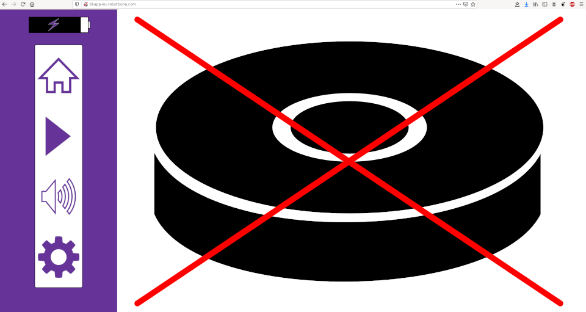
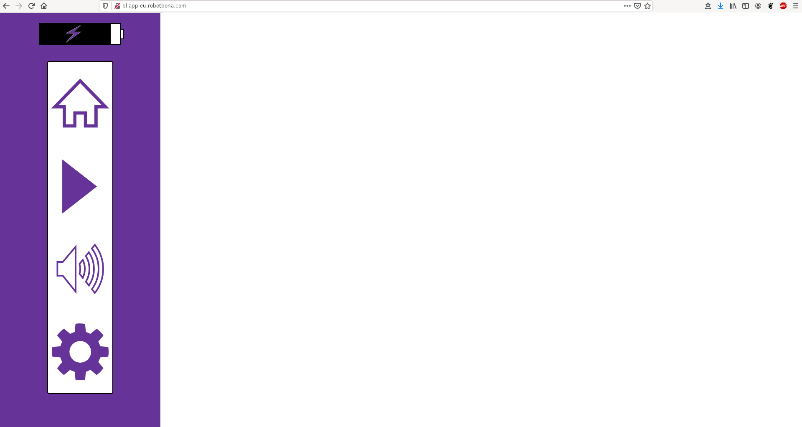
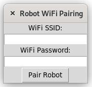
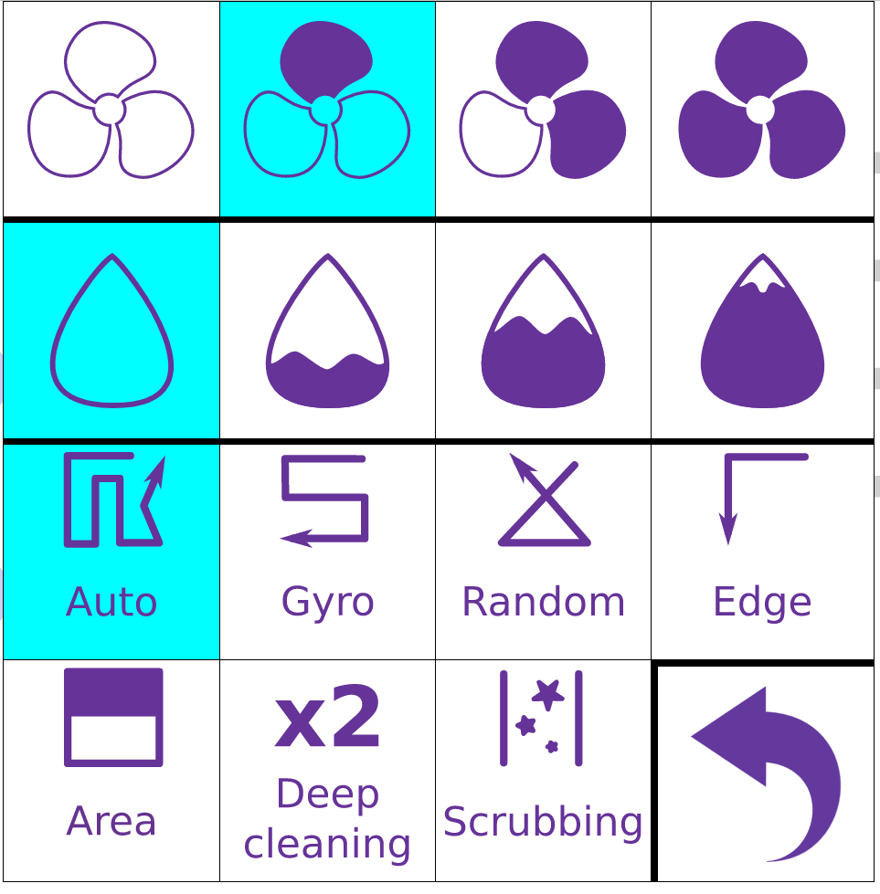
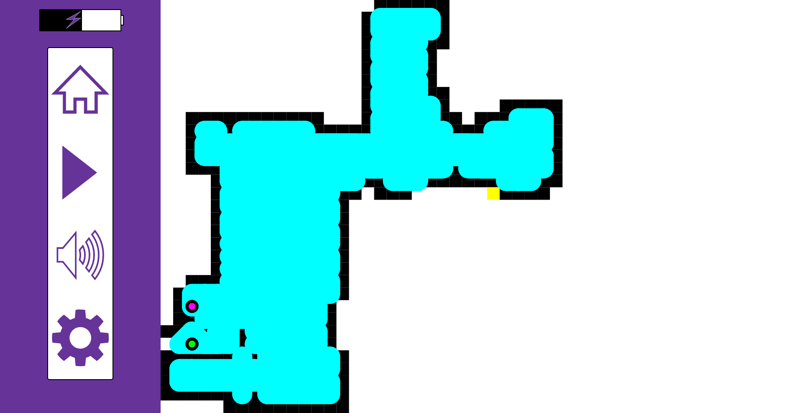

# OpenDoñita

OpenDoñita is a server designed to work with the **Conga 1490/1590** robotic vacuum cleaners distributed by **Cecotec**
in Spain. Since it is really a robot manufactured by the chinese company **robot bona**, it is very probable that it
would work with other robots.

All the documentation is in my personal blog: https://blog.rastersoft.com/?p=2324 (in spanish).

## Dependencies

The server requires python 3.6 or greater and the *iot-upnp* module. It can be installed with

    sudo python3 -m pip install iot-upnp

The */etc/hosts* configurator requires the *netifaces* module, which can be installed with

    sudo python3 -m pip install netifaces

## Using OpenDoñita

### The easy way

Just take a Raspberry Pi (I tested it with OSMC, but any OS should work, as long as the ports 80 and 20008 aren't in use),
copy this repository in a folder at $HOME, and run as root the **install.sh** script. It will install the packages needed
(*dnsmasq*, *python3-pip*, *netifaces* and *iot-upnp*), install the OpenDoñita server, configure the local DNS, and launch
everything.

Now you have to go to your WiFi router and configure there the IP of that Raspberry Pi as the DNS. This is a must because
the robot expects to find the server at the domains **bl-app-eu.robotbona.com** and **bl-im-eu.robotbona.com**. This is
why the installer installs *dnsmasq* and configures those two domains pointing to the same Raspberry Pi.

You can check if everything works fine by opening a browser in your computer and going to **bl-app-eu.robotbona.com**
(of course, assuming that you haven't changed the DNS in your PC, and it uses whichever the router specifies). It should
show this:

If you receive something different, try first to reboot your computer to ensure that it is using the new DNS, and not
the old one.

After having done this, you can jump to **Conecting the robot to the new server**

### The manual way

If you prefer to do everything manually to have more control, follow these instructions.

To use it, you must first install your own DNS server in your internal network. I used a Raspberry Pi with *dnsmasq* and
*hostapd* to build an isolated WiFi network, but in normal operation it is enough to launch *dnsmasq* and redirect the DNS
petitions from your WiFi router to the Raspberry.

Now, in the computer with the DNS, edit the file */etc/hosts* and add these two entries:

* 192.168.X.Y    bl-app-eu.robotbona.com
* 192.168.X.Y    bl-im-eu.robotbona.com

being 192.168.X.Y the IP address of the computer where the server will run (usually it should be the Raspberry Pi too).
This is a must because the robot connects to a server in those domains (which this project replaces), to receive from
them the commands. The official Android/iPhone app doesn't send commands directly to the robot, but only to the server,
and it resends them to the robot. Thus, to allow our local server to pose as the official one, we must redirect those
two domains to our own computer.

IMPORTANT: the new server requires Python 3.6 or later. Keep it into account if you want to reuse a RPi that you are
already using.

Now restart *dnsmasq* with *sudo systemctl restart netmasq* to ensure that it re-reads the configuration.

The next step is to change the DNS in your WiFi router to point to the Raspberry if you aren't using an isolated WiFi
network. This is dependant on your specific router.

After doing this, entering those domains in your browser should return an error.

Now, copy all the files of this project in the computer choosen to be your own server, and install it with:

    sudo ./install.sh

After doing this, it will be installed in /opt/congaserver, a new systemd service will be created and enabled (which will
be useful if the board reboots), but you still will have to launch it manually the first time with:

    sudo systemctl start congaserver.service

Now you can check if everything works by opening any of the previous domains in your browser. You should see this page:

## Connecting the robot to the new server

Now there are three ways of connecting the robot to the server:

* turn off the WiFi router and turn on again (or stop *hostapd*, wait some seconds, and start it again if you are using
an isolated WiFi network)

* or turn off the robot for some seconds and turn on it again. This requires removing it from the charging base and
turning it off with the lateral switch.

* or pair it manually as specified in the next section.

## Pairing the robot manually

To pair the robot you need a computer with a WiFi adapter. First, put your robot in *pairing mode* by pressing the power
button until it sends a beep. The Wifi light will blink.

Now, in your computer, search for a WiFi network called *CongaGyro_XXXXXX* (if you are using a robot from another distributor,
the Wifi SSID can change) and connect to it (it has no password).

After connecting, run in your computer the program **pairconga.py**. It is a python program that should work in Windows,
Linux and Macintosh (if you have installed python3, of course). It will show a window like this one:

Type in the first field the SSID of your WiFi, in the second field the password, and do click in **Pair robot** button.
Wait the answer (which should be "Pairing OK"), and now your robot should be paired with the WiFi and connected to your
local server.

## Using the new app

Now you can open the main app in a browser just by typing the IP address of your RPi.

In the main screen you have four buttons:

The *home* button: when it is filled of color, it means that the robot is not in the base. Clicking on it will send it
to the charger.

The *play* button: this triangle starts a new clean cycle, and will change to a square (or *stop*) button, which will
stop the clean cycle.

The *map/manual control* button: it alternates between MAP mode and MANUAL CONTROL mode.

The *settings* button: this button will open a popup where it is possible to choose the fan power, the water flux, the clean mode and the sound mode:

This configuration will be remembered even if the robot is turned off and on again.

During cleaning, the app will generate the map in real time:

Doing a displacement with the finger over the screen (or with the mouse) will rotate the map 90 degrees in the specified direction.

## Using the Android App

The Android app is available in a separate repository: https://gitlab.com/rastersoft/opendonita_android

It is just a simple WebView-based app, which uses the uPnP announcements of the main server to automagically locate it
in the network and open the web app.

## REST API

The server offers a REST API and a full HTTP server running at port 80. It recognizes the following paths and objects:

* **/baole-web/common/sumbitClearTime.do**: part of connecting negotiation process
* **/baole-web/common/getToken.do**: part of connecting negotiation process
* **/baole-web/common/**: part of connecting negotiation process
* **/robot**: commands for managing and controlling the robots
* **anything else**: the file will be searched in the *html* folder

Every time a call returns something, it will be a JSON file with this format:

    {
        "error": error_value,
        "value": data_to_be_returned
    }

**error** is a numerical value. The possible values are:

0. No error
1. Missing robot ID
2. Invalid robot ID
3. Robot is not connected to the server
4. Robot still not identified in server
5. Unknown command
6. Missing parameter
7. Invalid value (like "out of range", or similar)
8. Key doesn't exist in persistent data

If the error value is zero, then *data_to_be_returned* can be an array, a dictionary... something dependent on the command
executed. But if the error is not zero, then *data_to_be_returned* will be an string.

Under the **robot** path you can use **/robot/list** to get a list of the currently available robots connected to the server.
In the returned JSON, *data_to_be_returned* will be an array with zero or more strings. Each string is a robot identifier,
which can be used in the other commands.

To send an specific command to a robot, you use a path with the following format:

    /robot/robot_id/command

or, if the command requires parameters, then:

    /robot/robot_id/command?param1=value1&param2=value2...

In both cases, *robot_id* is an id returned by **/robot/list**, but can be replaced with *all*, and the command will be sent
to all the robots currently connected. The commands are stored in a queue and sent one by one to the robot.

The available commands are:

* **clean**: orders the robot to start cleaning
* **stop**: pauses the cleaning operation
* **return**: orders the robot to return to the base
* **updateMap**: orders the robot to send a map update
* **askStatus**: orders the robot to send an status update
* **notifyConnection**: notifies the robot that a web client has been opened
* **mode**: allows to set the cleaning mode. It has one parameter, *type*, with any of these values:
    * auto
    * gyro
    * random
    * borders
    * area
    * x2
    * scrub
* **fan**: sets the fan speed. It has one parameter, *speed*, with a value from 0 to 3 (bigger value means more speed)
* **watertank**: sets the watertank speed. It has one parameter, *speed*, with a value from 0 to 3 (bigger value means more speed)
* **sound**: allows to enable or disable the buzzer. It has one parameter, *status*, with a zero value to disable it, or one value
to enable it.
* **goForward**: manual control. Makes the robot to advance. Must be resent periodically (every two seconds) to keep it active, or the server will stop the movement automatically.
* **goBack**: manual control. Makes the robot to move backwards. Must be resent periodically (every two seconds) to keep it active, or the server will stop the movement automatically.
* **turnLeft**: manual control. Makes the robot turn counterclockwise. Must be resent periodically (every two seconds) to keep it active, or the server will stop the movement automatically.
* **turnRight**: manual control. Makes the robot turn clockwise. Must be resent periodically (every two seconds) to keep it active, or the server will stop the movement automatically.
* **stayStill**: manual control. Makes the robot to stop the last movement order sent.
* **wait**: allows to wait a configurable number of seconds before continuing executing the commands in the queue. It has one parameter,
*seconds*, with a float/integer value expressing the number of seconds to wait.
* **waitState**: allows to wait for the robot to be in an specific state before continuing executing the commands in the queue. It has one parameter, *state*, which can have any of these values:
    * cleaning
    * stopped
    * returning
    * charging
    * charged
    * home
* **getStatus**: allows to get the current status of the robot. *data_to_be_returned* will contain a dictionary with data obtained from
the pairing process, from *status* events, or from *error* events.
* **setStatus**: allows to modify an entry in the status. Usually the entry value will be overwritten again when the robot updates its
state, but some entries (like *error*) can be useful to be modifiable. It receives one or more parameters, being the name of the entry
or entries to be modified and their new value. It returns a dictionary with the new *status* values.
* **getProperty**: allows to get a property. Properties are non-volatile pairs of *key*-*value*, useful to store the configuration of
the robot, or other things. If no parameter is passed, a dictionary with all the properties is returned; instead, if a *key* parameter
is passed, only the value for the key specified by it will be returned.
* **setProperty**: allows to set a property value. It receives two parameters: *key*, with the key to set or modify, and *value*, with
the new value. The new value is stored in permanent storage immediately. All values are converted into strings before being stored.
* **setDefaults**: sets the fan, water and clean mode in the robot to the values stored in the properties.

## Author

Sergio Costas  
http://www.rastersoft.com  
rastersoft@gmail.com  
